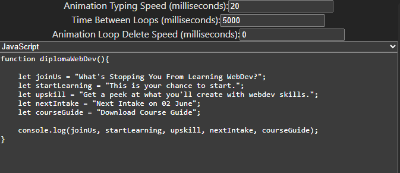
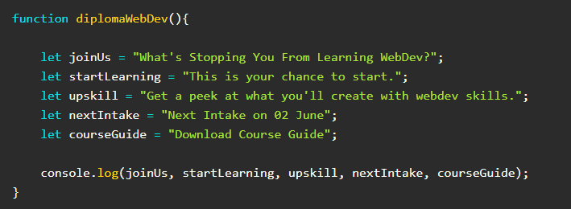

# Code Typing Visualiser

Fun lil tool to help make some nifty marketing assets. Get your screen-recording software ready!

## Usage

You can set the properties along the left side of the webpage to control how fast the animation runs, how long it waits after typing out the full message before deleting it all, and how quick it'll be to delete the text when it restarts the animation.

When entering your code, it's typically best to just write it out in another program (especially if you write using tabs instead of spaces), as some keys will get used by the browser (again, such as the tab key). 

I haven't configured this to do any code wrapping, so keep your line lengths short!

